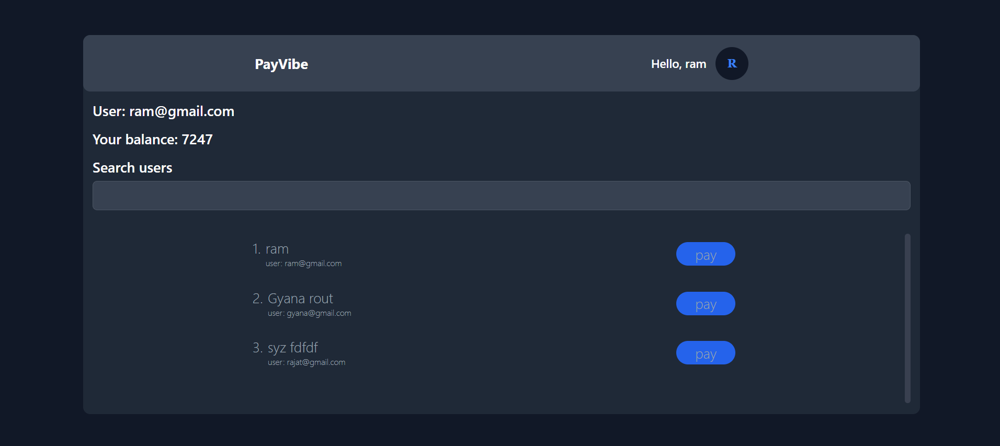

# Paytm wallet PayVibe

## Demo



## Project Overview

**Paytm Wallet** is a digital wallet application where users can sign in and securely transfer money to other registered users. The project is built using the **MERN stack** (MongoDB, Express.js, React.js, and Node.js), providing a robust and scalable solution.

### Key Features:

- User registration and login system
- Secure money transfers between users
- JWT-based authentication for enhanced security
- **Payment history** tracking for all transactions
- Ability for users to **update account information**
- Option to **delete user accounts**
- Fully responsive UI using **Tailwind CSS**
- Real-time updates and seamless user experience

This project is ideal for anyone looking to understand the implementation of a wallet system using modern web development technologies.

## Tech Stack

**Client:** React, recoil, react-router-dom, TailwindCSS

**Server:** Node, Express, zod, jwt

**Databse:** Mongodb, mongoose

## Run Locally

Clone the project

```bash
  git clone https://github.com/Bibek-only/paytm.git
```

Go to the project directory

```bash
  cd paytm
```

Install dependencies on both frontent and backend

```bash
  cd frontend && npm i
  cd backend && npm i
```

Add a .env file in the foot folder of the backend

```bash
 DATABASE_URL=mongodb://localhost:27017/paytm
 PORT=3000
 JWT_SECRET=YOURJWTSECRT
 ORIGIN=*
```

Start backend server

```bash
  cd backend && npm run build
```

Start frontend

```bash
  cd frontend && npm run dev
```

## Author

- [@Bibek samal](https://github.com/Bibek-only)
